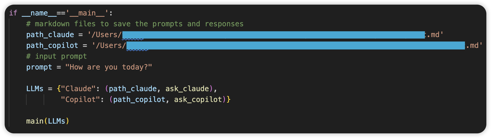
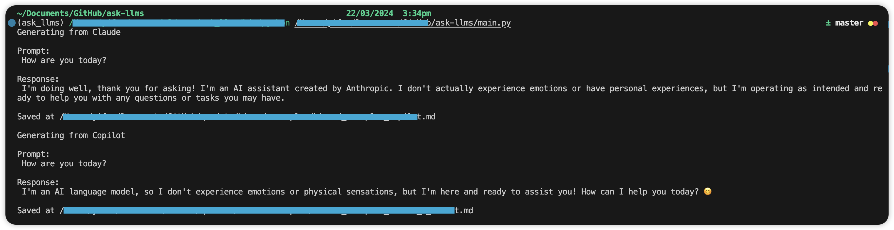

# Ask LLMs

## TO-DOs
- [x] Optimise `README.md`
- [x] Add `environment.yml`
- [ ] Change default Markdown to text
- [ ] Add functions to transform local file formats

## Highlights

Multiple LLMs, free to use, all at once. 

## Supported LLMs

| LLM                                                          | Cookie | Free API |
| ------------------------------------------------------------ | ------ | -------- |
| [Claude 2](https://www.anthropic.com/news/claude-2)          | ❌      | ✅        |
| [Copilot](https://www.microsoft.com/en-au/microsoft-copilot/) | ❌      | ✅        |
| [ChatGPT 3.5](https://openai.com/chatgpt)                    | ❌      | ❌        |

## Requirements

- Python 3.10 +
- For Claude 2
  - [Firefox Browser](https://www.mozilla.org/en-US/firefox/all/)
  - [geckodriver](https://github.com/mozilla/geckodriver)
- For Copilot:
  - [Microsoft account](https://account.microsoft.com/account/manage-my-account)  (optional)

## Install API Packages & Environment

- Install API packages separately:

	- For [Claude 2 API package]([st1vms/unofficial-claude2-api](https://github.com/st1vms/unofficial-claude2-api?tab=readme-ov-file).): 

  ``` bash
  pip install unofficial-claude2-api
  ```

	- For  [Copilot API package]([vsakkas/sydney.py](https://github.com/vsakkas/sydney.py).):

  ``` bash
  pip install sydney-py
  ```

- Install all dependencies through [conda](https://conda.io/projects/conda/en/latest/user-guide/install/index.html):
  ``` bash
  conda env create -f environment.yml
  ```

## Example

1. In `main.py`, customise your local Markdown paths for saving Q&As. For example:

``` python
path_claude = '/example_path/for/qa_claude.md'
path_copilot = '/example_path/for/qa_copilot.md'
```

2. Input your prompt that will be sent to multiple LLMs. For example:
	
``` Python
prompt = "How are you today?"
```

Your code now should look like this:



3. Run `main.py`.

4. Responses from LLMs will be shown in your terminal. Q&As will be saved at the local paths. For example:



## Seek Help

- Anything related to Claude 2:

  See more information from [st1vms/unofficial-claude2-api](https://github.com/st1vms/unofficial-claude2-api?tab=readme-ov-file).

- Anything related to Copilot:

  See more information from [vsakkas/sydney/py](https://github.com/vsakkas/sydney.py).

- Anything related to this repository:
Feel free to create issues/discussions/PRs : )

## Disclaimer

The repository is free to use and for education purposes only. The repository is maintained by independent contributors who are NOT AFFILIATED with [Claude 2](https://www.anthropic.com/news/claude-2) and [Copilot](https://www.microsoft.com/en-au/microsoft-copilot/), and all API packages are NOT OFFICIAL from [Claude 2](https://www.anthropic.com/news/claude-2) and [Copilot](https://www.microsoft.com/en-au/microsoft-copilot/).
