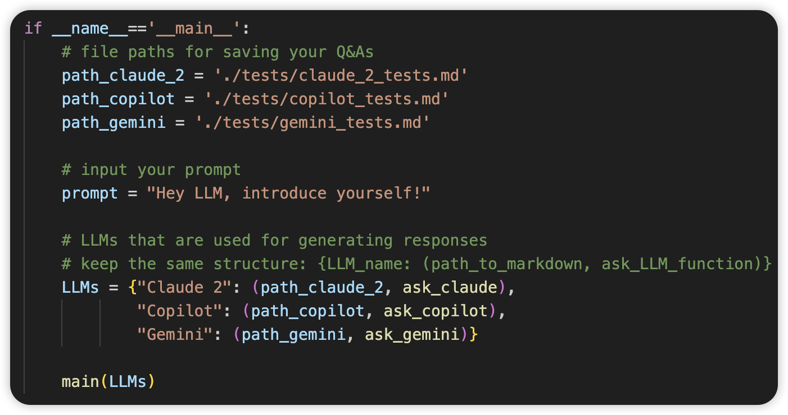
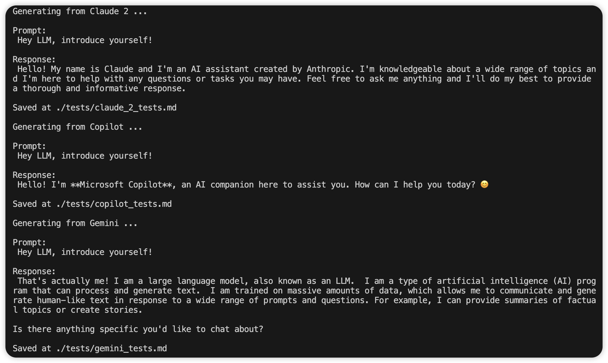

# Ask LLMs

## TO-DOs
- [x] Optimise `README.md`
- [x] Add `environment.yml`
- [ ] Change default Markdown to text
- [x] Add `Gemini`

## Highlights

Multiple LLMs, free to use, all at once. 

## Supported LLMs
[Claude 2](https://www.anthropic.com/news/claude-2) | [Copilot](https://www.microsoft.com/en-au/microsoft-copilot/) | [Gemini](https://gemini.google.com/t)

## Requirements

- Python 3.10 +
- For Claude 2
  - [Firefox Browser](https://www.mozilla.org/en-US/firefox/all/)
  - [geckodriver](https://github.com/mozilla/geckodriver)
- For Copilot:
  - [Microsoft Account](https://account.microsoft.com/account/manage-my-account)  (optional)
- For Gemini:
  - [Google Account](https://www.google.com/account/about/)

## Install API Packages & Environment

- Install API packages separately:

  For [Claude 2 API package]([st1vms/unofficial-claude2-api](https://github.com/st1vms/unofficial-claude2-api).): 

  ``` bash
  pip install unofficial-claude2-api
  ```

  For  [Copilot API package]([vsakkas/sydney.py](https://github.com/vsakkas/sydney.py).):

  ``` bash
  pip install sydney-py
  ```

  For [Gemini API package](https://github.com/HanaokaYuzu/Gemini-API):
  ``` bash
  pip install gemini_webapi
  ```
  
  The following package is optional. See more difference [here](https://github.com/HanaokaYuzu/Gemini-API?tab=readme-ov-file#initialization).
  
  ``` bash
  pip install browser-cookie3
  ```

- Install all dependencies through [conda](https://conda.io/projects/conda/en/latest/user-guide/install/index.html):
  ``` bash
  conda env create -f environment.yml
  ```

## Example

1. Clone the repository from URL or using SSH key:
``` bash
git clone https://github.com/southern-cross-ai/ask-llms.git
```
``` bash
git clone git@github.com:southern-cross-ai/ask-llms.git
```
   
2. In `main.py`, customise your local Markdown paths for saving Q&As. For example:

``` python
path_claude_2 = './tests/claude_2_tests.md'
path_copilot = './tests/copilot_tests.md'
path_gemini = './tests/gemini_tests.md'
```

3. Input your prompt that will be sent to multiple LLMs. For example:
	
``` Python
prompt = "Hey LLM, introduce yourself!"
```

Your code now should look like this:



4. Run `main.py`.

5. Responses from LLMs will be shown in your terminal, and will be saved at the local paths. For example:

    

## Seek Help

- Anything related to Claude 2:

  See more information from [st1vms/unofficial-claude2-api](https://github.com/st1vms/unofficial-claude2-api?tab=readme-ov-file).

- Anything related to Copilot:

  See more information from [vsakkas/sydney/py](https://github.com/vsakkas/sydney.py).

- Anything related to Gemini:

  See more information from [HanaokaYuzu/Gemini-API](https://github.com/HanaokaYuzu/Gemini-API). 

- Anything related to this repository:
Feel free to create issues/discussions/PRs : )

## Disclaimer

The repository is free to use and for education purposes only. The repository is maintained by independent contributors who are NOT AFFILIATED with [Claude 2](https://www.anthropic.com/news/claude-2), [Copilot](https://www.microsoft.com/en-au/microsoft-copilot/) and [Gemini](https://gemini.google.com/), and all API packages are NOT OFFICIAL from Claude 2, Copilot and Gemini.
